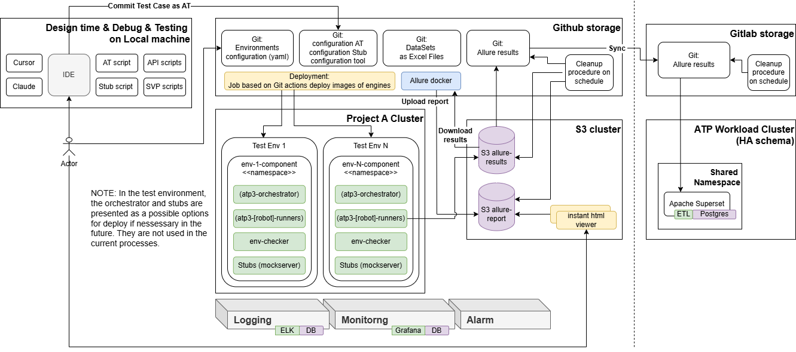

# QSTP3 Package Description

## Services list

### Playwright

Playwright is used for E2E test automation and acts as an orchestrator when a Bruno collection needs to be called within an E2E test. 
Various types of steps can be involved during E2E testing, such as Excel data processing, UI navigation, REST API calls, and SSH commands.

Key features include:
- Automated provisioning of test environments and dependencies
- Execution of Playwright test suites from modular, versioned collections
- CI/CD integration to fit seamlessly into existing pipelines
- Secure handling of credentials and deployment parameters
- Flexible configuration for a variety of infrastructure and S3-compatible storage backends
- Integration with Allure, generate Allure results
- Integration with monitoring system (Victoria metrics).

Link to repository (**this** repository): https://github.com/Netcracker/qubership-testing-platform-playwright-runner

### Python

Python is primarily used when tests need to be executed within Kubernetes (e.g., HA tests), as Pytest can interact directly with the K8s cluster.

Qubership Testing Platform Python Collections Runner is a CI/CD utility. It's designed to automate and manage the deployment and execution of Python-based test collections. 
It streamlines setting up test environments, deploying applications, validating infrastructure, and securely running Python tests in cloud-native environments. 
The runner integrates with Git repositories, collects environment variables, and supports parameterized test launches suitable for modern DevOps workflows.

Key features include:

- Automated provisioning of test environments and dependencies
- Execution of Python test suites from modular, versioned collections
- CI/CD integration to fit seamlessly into existing pipelines
- Secure handling of credentials and deployment parameters
- Flexible configuration for a variety of infrastructure and S3-compatible storage backends.

Link to repository: https://github.com/Netcracker/qubership-testing-platform-python-runner

### Robot framework

Historically, Robot Framework has been used as the engine for automated tests for the Cloud platform. 
Among its key features, it enables the automation of user actions in the UI and provides the ability to work with Kubernetes methods. 
This capability is made possible due to Robot Framework's support for Python and Java.

Nevertheless, an adapter was developed to generate reports in the Allure format and to save results to S3 storage. This adapter is deployed in each of the streams with the tests.

### Bruno

Bruno is used for north-bound integration testing. Individual calls can be aggregated into collections.

Key features include:
- Automated provisioning of test environments and dependencies
- Execution of Playwright test suites from modular, versioned collections
- CI/CD integration to fit seamlessly into existing pipelines
- Secure handling of credentials and deployment parameters
- Flexible configuration for a variety of infrastructure and S3-compatible storage backends
- Integration with Allure, generate Allure results
- Integration with monitoring system (Victoria metrics).

Link to repository: https://github.com/Netcracker/qubership-testing-platform-bruno-runner

### Newman

Newman is also used for north-bound integration testing. The Newman runner ensures the launch and execution of Postman collections within the CI process.

Key features include:
- Automated provisioning of test environments and dependencies
- Execution of Playwright test suites from modular, versioned collections
- CI/CD integration to fit seamlessly into existing pipelines
- Secure handling of credentials and deployment parameters
- Flexible configuration for a variety of infrastructure and S3-compatible storage backends
- Integration with Allure, generate Allure results
- Integration with monitoring system (Victoria metrics).

Link to repository: https://github.com/Netcracker/qubership-testing-platform-newman-runner

### Allure

Allure results and Allure report are used as an industry standard in the role of a unified report format for the results of automated test execution.

Brief description of Allure usage for Qubership streams:
- During test execution, the engine saves Allure results, and after the entire scope is completed, the adapter saves the Allure results to S3 storage.
- S3 storage notifies Git that new results are available.
- Git triggers the Allure report workflow.
- Within the Workflow process:
  - Allure results are downloaded
  - Allure-report tool is downloaded and installed from the official open-source repository https://github.com/allure-framework/allure2
  - A report is generated in Allure report format
  - The report is saved to S3 storage in the report folder
  - Allure results are saved to a separate repository https://github.com/Netcracker/qubership-testing-results for further synchronization with Gitlab
  - To view the Allure report in a browser, it is sufficient to download a single file /allure-report/index.html and open it in the browser.

Link to Allure report workflow: https://github.com/Netcracker/qubership-terraform-hub/blob/main/.github/workflows/process-s3-report.yml

### TDM

TDM (**Test Data Management** Service) Repository contains only backend implementation. Link to repository: https://github.com/Netcracker/qubership-testing-platform-tdm3

## Architectural schema

Architectural and Deployment Schema of Qubership Environment is: 
